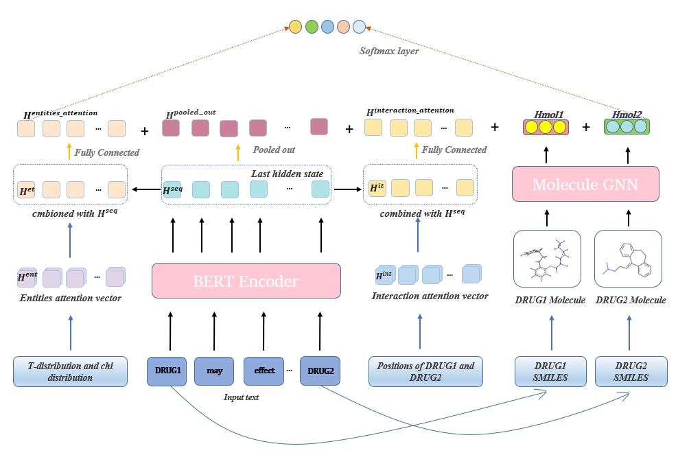
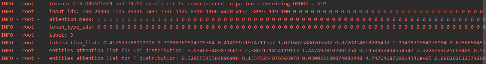
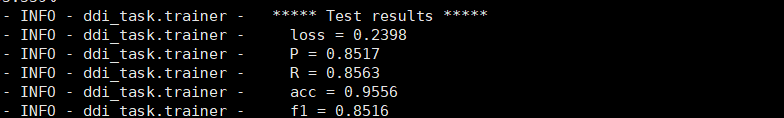

# IMSE:Interaction Information Attention and Molecular Structure Based Drug Drug Interaction Extraction
* The 'model_architecture' picture shows the architecture of the proposed model. 
 

* The 'Input_example' picture shows the input example of the model. 
 


# Requirement
To run the code, you need the following dependencies:
* Python == 3.6.6
* transformers == 4.4.2
* torch == 1.8.1+cu102
* scipy == 1.4.1
* scikit-learn == 0.24.1


# Dataset
* The dataset contains DDI Corpus and Fingerprint data. 
* Due to copyright reasons, we only provide part of the sample, detailed data please refer to https://www.cs.york.ac.uk/semeval-2013/task9/.
* Because the molecular structure file is large, it cannot be uploaded. Please refer to the files in dataset/fingerprint/ to generate the molecular structure file.
# resouces
* This folder contains the trained weights we need, what we're using here is "bio_bert_pubmed_v1.1". You can refer to https://github.com/dmis-lab/biobert.
* We have tried other pre-training versions, such as Scibert (https://github.com/allenai/scibert), but we didn't get much difference between the results, or as good as Biobert.
# model.py
* This file is the concrete structure of the model.
* You can run the following models by setting the parameter --model in the run_re.sh file:
* 1: "only_bert"  by --model "only_bert"
* 2: "BERT + Interaction attention vector"  by --model  "bert_int"
* 3: "BERT + Molecular"  by --model  "bert_mol"
* 4: "BERT + Interaction attention vector + Molecular"  by --model   "bert_int_mol"
* 5: "BERT + Interaction attention vector + Entities attention vector + Molecular"   by --model   "bert_int_ent_mol"
# ddi_task
* This folder contains our main code. 
* load_data.py is used to prepare the data, we undersample and oversample the training set by default.
* run_re.sh is the script used to run man_run.py. You can run our project by running this script.
* utils.py is used to implement some ancillary functions. 

# How to run
```
cd ddi_task
sh run_re.sh
```
# The best result
* The following picture shows the best result of our method. 
 
